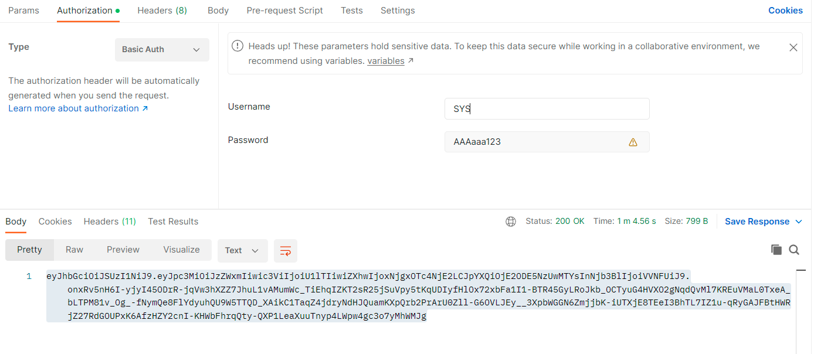
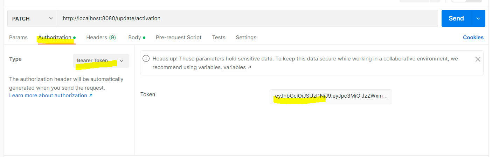

# ToDoList
This is simple implementation of 'To do list" app in REST architecture

using:

-Spring JPA

-Spring Boot

-Spring security (JWT  barear token)

and H2 in-memory DB

# Deployment

you need JRE 17 or greater (download here: https://www.oracle.com/java/technologies/javase/jdk17-archive-downloads.html)

You have two options to run the app:

First, checkout the master branch to your local PC and import it to your favorite IDE

then you can run the app directly from the IDE or you can copy app.jar from target directory and run in command prompt

java -jar app.jar

after application has been deployed and running, an H2 in memory DB automatically created with the following tables.
OWNERS(Users) table
TASKS
COMMENTS

a default Admin user called SYS created on the application startup

credentials: 

username: SYS

password: AAAaaa123

you can access the DB via web browser on URL:
http://localhost:8080/h2-console
you will see the following login screen

enter credentials:
user name: admin
password: 1234

# How to use
first you need to download Postman from here https://www.postman.com/downloads/

the application receive the following requests, all in JSON format

in order to start working you first need to authenticate yourself as the SYS user and receive a token:

POST localhost:8080/login (no body)

After that, on each request you made you need to past the token, otherwise you will get

401 Unauthorized

#User operations

#get all users in the DB

GET localhost:8080/user/all (no body needed)

#add new user

POST http://localhost:8080/user/add

{

"name": "username",

"email": "email@myOrg.com",

"isAdmin":false,

"isActive": false,

"password":"password",

"requester": "SYS" //(or any admin user)  mandatory field

}

the requester parameter value must be username that exist in the DB

#update user details (email\password\name)

PATCH http://localhost:8080/user/update/general-data

{

"name": "username",

"email": "email@myOrg.com",

"password":"password",

"requester":"SYS"  //(or any admin user). mandatory field

}

#change user role (admin\regular user)

PATCH http://localhost:8080/user/update/isAdmin

{

"name":"username",

"isAdmin": true, //false

"requester":"SYS"  //(or any admin user). mandatory field

}

#activate\deactivate users

PATCH http://localhost:8080/user/update/activation

{

"name":"username",

"isActive": true, //false

"requester":"SYS"  //(or any admin user). mandatory field

}

#delete user

DELETE http://localhost:8080/user/{name}

{

"requester":"SYS" //(or any admin user). mandatory field

}

e.x: DELETE http://localhost:8080/user/dan will delete the user with value "dan" on the name field

#Task operations

#get all tasks in the system

GET localhost:8080/task/get-all (no body needed)

#get task by assignee

GET localhost:8080/task/get-all/dan

{

"requester":"dan" //admin or assignee. mandatory field

}

in this example you will get all tasks assigned to user Dan. if you replace the requester Dan with any other user with admin role, this will also work because

user with admin role can see all the tasks for all users. A non-admin user can see only his tasks

consider two users, Shay and Dan. the following example will produce an error since Shay asks to see Dan's tasks

GET localhost:8080/task/get-all/dan

{

"requester":"shay"

}

BUT, if Shay is admin, the he WILL see Dan's tasks

#add a task

POST localhost:8080/task/add

{

"title":"title",

"description": "description",

"assignee":"assignee",

"requester":"SYS" //(or any admin user). mandatory field

}

OK response should look loke this in console:

{

"title": "title",

"description": "description",

"status": "PENDING",

"assignee": "assignee",

"id": 1,

"visible": true

}

it is important to take a note of the id parameter value. This is needed in other requests

#delete a task

DELETE localhost:8080/task/{task_id}

{

"requester":"SYS" //(or any admin user). mandatory field

}

you can obtain the task_id parameter value from the H2 DB console (TASK table) or from the response of the 'add task' API

e.x DELETE localhost:8080/task/3 will delete the task with id 3

#change task assignee

PATCH http://localhost:8080/task/assignee-update/{task_id}

{

"assignee": "new assignee",

"requester":"SYS" //(or any admin user). mandatory field

}

you can obtain the task_id parameter value from the H2 DB console (TASK table) or from the response of the 'add task' API

#update task status

task status start with PENDING status by default. the assignee can move it to COMPLETE status and the next status after COMPLETE is ARCHIVED. only admin users can
move the task to status ARCHIVED. 'get task by user' API will not show ARCHIVED tasks.
the update operation must follow a certain flow: PENDING>COMPLETED>ARCHIVED

the Status enum values are:

PENDING(1),

COMPLETED(2),

ARCHIVED(3),

PATCH localhost:8080/task/status-update/{task_id}

{

"status": 2,  //new status for task

"requester":"user" //any user, in case new status is 2, admin user in case new status is 3

}

e.x PATCH localhost:8080/task/status-update/3 will change the status of task 3 from PENDING to COMPLETED

#update task general data: title or description

PATCH localhost:8080/task/general/{task_id}

{

"title": "new title",

"description": "new desc",

"requester": "SYS" //(or any admin user). mandatory field

}

#Comment operations

#get assignee comment

return an assignee comment

in this case, the requester can be any user that exist on the system

GET localhost:8080/comment/get-all/{username}

{

"requester":"SYS" // or ANY user on the system

}

e.x GET localhost:8080/comment/get-all/shay will retrieve the user Shay and the task assigned to Shay (e.g Shay is the assignee). the OK response should look like:

[

{

"userId": {

"name": "shay",

"email": "dan@gmail.com",

"isAdmin": false,

"isActive": false,

"password": "4543523",

"requester": "SYS",

"id": 2

},

"taskId": {

"title": "tas3",

"description": "des3c2",

"status": "PENDING",

"assignee": "shay",

"id": 2,

"visible": true

},

"date": "2023-04-10T18:52:46.898+00:00",

"comment": "sssssssssssssssssssss",

"id": 2

}

]

#add comment to task

POST localhost:8080/comment/add

only admin user or the task's assignee  can add comment to task

POST localhost:8080/comment/add

{

"taskId":1, // the taskId the comment will associated to

"assignee": "shay",

"comment": "comment",

"requester":"shay"  //any admin user or the task assignee

}

e.x if task 1 assigned to Shay, then the above request will work. Also if requester is not the assignee but he is an user with admin role.

the below request will produce an error because Dan has no admin role and he isnt assigned to task 1

{

"taskId":1,

"assignee": "shay",

"comment": "comment",

"requester":"dan"

}
